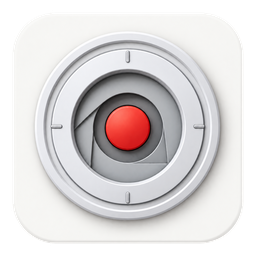

# Recordio

[简体中文](README.zh-CN.md) | English

<p align="center"></p>

Recordio is a free, open-source desktop screen recorder and video editor for demos, tutorials, and presentations. It is an **independent modified version of [Recordly](https://github.com/webadderallorg/Recordly)**, not an official Recordly release. Recordly was itself derived from OpenScreen. This source snapshot is based on [Recordly commit 1888428](https://github.com/webadderallorg/Recordly/commit/1888428); upstream history is available in the original repository. Upstream copyright and license notices are retained here.

## What Recordio improves

The features below describe changes relative to the Recordly base used for this repository. Recordly already provides screen recording, editing, zooms, backgrounds, and cursor effects.

- **Cursor presentation:** additional scalable cursor designs; separate left and right click appearance, colors, and built-in sounds; smoother cursor movement and click rendering.
- **Motion and visual quality:** more motion presets, including elastic choices; smoother rounded video outlines and click ripples in preview and export.
- **Editing workflow:** project loading feedback, stronger timeline selection outlines, timeline zoom and adjustable frame/second stepping, keyboard navigation, and a command to clear all zoom effects.
- **Export workflow:** choose the destination before rendering; high-bitrate options; elapsed time and adaptive remaining-time estimates; completion sound; improved handling of silent recordings and encoder fallbacks. Export still depends on codecs and hardware available on the computer.
- **Recording and library:** changes for long-recording save reliability; confirmed project deletion can also move its source video and associated cursor, diagnostics, and audio files to Trash, while protecting recordings used by another project.
- **Interface and identity:** expanded Simplified Chinese text, localized notifications and shortcuts, and a separate Recordio app identity and data directory so it can coexist with Recordly.

## Platforms and building

The source targets Windows, macOS, and Linux. Windows packaging has been run locally. macOS packages require a macOS build host and have not been verified on this Windows development machine.

Use Node.js 22 and npm:

```bash
npm ci
npm run build:win   # on Windows, x64 installer
npm run build:mac   # on macOS, Intel and Apple silicon DMG/ZIP
```

`npm run build` selects the current host platform. The **Package Windows and macOS** GitHub Actions workflow builds both platforms on their native runners when manually started. macOS packages are unsigned unless Apple signing credentials are configured. Windows native helpers require Visual Studio Build Tools; macOS helpers require Xcode Command Line Tools. Project files retain the `.recordly` extension for compatibility.

## License and attribution

Recordio is distributed under the **GNU Affero General Public License, version 3** ([LICENSE.md](LICENSE.md)), the same license as the Recordly source on which it is based. Original source: [webadderallorg/Recordly](https://github.com/webadderallorg/Recordly); [upstream license](https://github.com/webadderallorg/Recordly/blob/main/LICENSE.md). Copyright notices for upstream contributors remain in the source and license. Recordio is independently maintained and is not affiliated with or endorsed by the Recordly authors.

Source and issues: [zhoufei3/Recordio](https://github.com/zhoufei3/Recordio).
